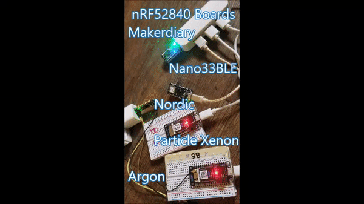

trying multiple nRF52840 Boards

So I tried the ocde blink-and-serial.ino on my selection of nRF52840 boards. Nordic, Makerdiary, Particle Argon and Xenon and the Nano33BLE. They all worked with the very simp,le blink the LED and read A0 at the serial port.

Note: P0_3   or P0_12  or P1_08  stand for direct pin connections to the nRF52840 SOC and really simplifies using the different boards.

Note: Getting the Pin wrong can brick your board. I bricked my Nordic board and it took a few attempts to re-install the bootloader.

